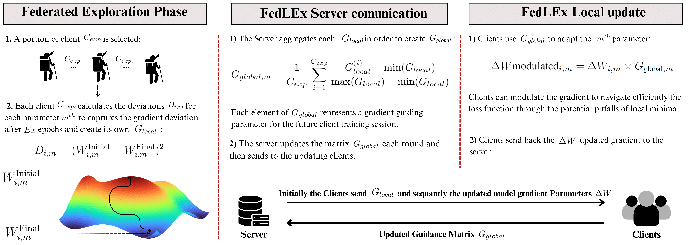

# Federated Loss Exploration for Improved Convergence on Non-IID Data
This is the repositoy for the paper FedLEx submitteed at WCCI'24 (IJCNN).

## Architecture Overview



This diagram illustrates the architecture of the FedLEx system, highlighting the interaction between clients and the server in the federated learning process.

## Getting Started

Before diving into the specifics, ensure you have activated your preferred virtual environment.

### Clone and Set Up the FedLEx Repository

```bash
git clone [FedLEx-repo-url] 
cd FedLEx 
git checkout [branch-name]
```

For the experimental code from this repository, see below.

## Installation
> :warning: Note: FedLEx has been tested exclusively on Linux environments.

First, create a fresh conda environment and activate it:
```bash
conda env create -f environment.yml
conda activate FedLEx
```
Install the required packages:
```bash
conda install pytorch==1.12.0 torchvision==0.13.0 torchaudio==0.12.0 torchtext==0.13.0 cudatoolkit=11.6 -c pytorch -c conda-forge
```

Please install torch-related packages using one command provided by the official guide (See official installation guide); e.g., conda install pytorch==1.12.0 torchvision==0.13.0 torchaudio==0.12.0 torchtext==0.13.0 cudatoolkit=11.6 -c pytorch -c conda-forge

## Repository and Code Structure
With FedLEx, we effectively navigate the complex loss surfaces inherent in federated, non-IID data and improve knowledge transfer in an efficient manner, since only a small number of epochs and a small amount of data are required to build a strong global guidance matrix to distill global knowledge and achieve model convergence without the need for additional data sharing or data distribution statics in a large client scenario.

The repository structure is organized as follows:
src: Contains the source code for algorithms, server and client implementations, and utilities.
checkpoints: Stores the GlobalGuidence matricies.
log: Saves all logs from the experiments.
results_paper: Holds the experimental outcomes referenced in the paper.
```
FedLEx/
├── src/
│   ├── algorithm/
│   │   ├── basealgorithm.py
│   │   ├── fedLEx.py
│   │   ├── fedavg.ipynb
│   │   └── ...
│   ├── server/
│   │   ├── fedlexserver.py
│   │   ├── fedavgxserver.py
│   │   └── ...
│   ├── client/
│   │   ├── fedlexclient_exploration.py
│   │   ├── fedavgclient.py
│   │   └── ...
│   ├── datasets/
│   ├── metrics/
│   └── models/
├── checkpoints/
├── logs/
├── result_paper/
└── main.py
```

## Abstract
Federated learning (FL) has emerged as a groundbreaking paradigm in machine learning (ML), offering privacy-preserving collaborative model training across diverse datasets. Despite its promise, FL faces significant hurdles in non-identically and independently distributed (non-IID) data scenarios, where most existing methods often struggle with data heterogeneity and lack robustness in performance. This paper introduces Federated Loss Exploration (FedLEx), an innovative approach specifically designed to tackle these challenges. FedLEx distinctively addresses the shortcomings of existing FL methods in non-IID settings by optimizing its learning behavior for scenarios in which assumptions about data heterogeneity are impractical or unknown. It employs a federated loss exploration technique, where clients contribute to a global guidance matrix by calculating gradient deviations for model parameters. This matrix serves as a strategic compass to guide clients' gradient updates in subsequent FL rounds, thereby fostering optimal parameter updates for the global model. FedLEx effectively navigates the complex loss surfaces inherent in non-IID data, enhancing knowledge transfer in an efficient manner, since only a small number of epochs and small amount of data are required to build a strong global guidance matrix that can achieve model convergence without the need for additional data sharing or data distribution statics in a large client scenario. Our extensive experiments with state-of-the art FL algorithms demonstrate significant improvements in performance, particularly under realistic non-IID conditions, thus highlighting FedLEx's potential to overcome critical barriers in diverse FL applications.

## Example
Start your FedLEx journey with the following example:
```
  python3 main.py\
      --exp_name "${n}_fedlex" --device cuda --result_path ./result_paper/10K/Patho/MNIST/TwoNN/fedlex \
      --dataset MNIST \
      --split_type patho --mincls 2 --test_fraction 0.2 \
      --rawsmpl 1.0 --resize 24  --randhf 0.5  --randjit 0.5\
      --model_name TwoNN --hidden_size 200 --dropout 0.1 --num_layers 2 --init_type xavier \
      --algorithm  fedlex --eval_type both --eval_every 1 --eval_metrics acc1 acc5 f1 precision recall\
      --K 10 --R 200 --E 5 --C 0.20 --B 350 --beta 0.9 \
      --optimizer Adam --lr  0.0003 --lr_decay 0.99 --lr_decay_step 1 --criterion CrossEntropyLoss\
      --Patience_mask 40 --epoochs_mask 150 --perc_clients_for_mask 1
```
## Acknowledgements

This project, **Federated Loss Exploration for Improved Convergence on Non-IID Data**, draws inspiration from the code structure for PyTorch implementation of the [Federated-Learning-in-PyTorch](https://github.com/vaseline555/Federated-Learning-in-PyTorch), developed by [@vaseline555](https://github.com/vaseline555).


